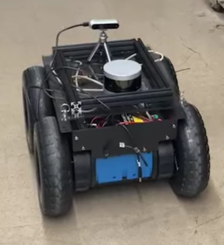
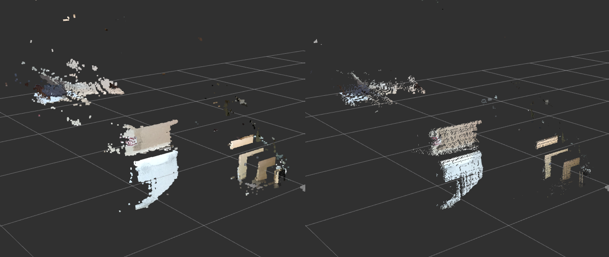
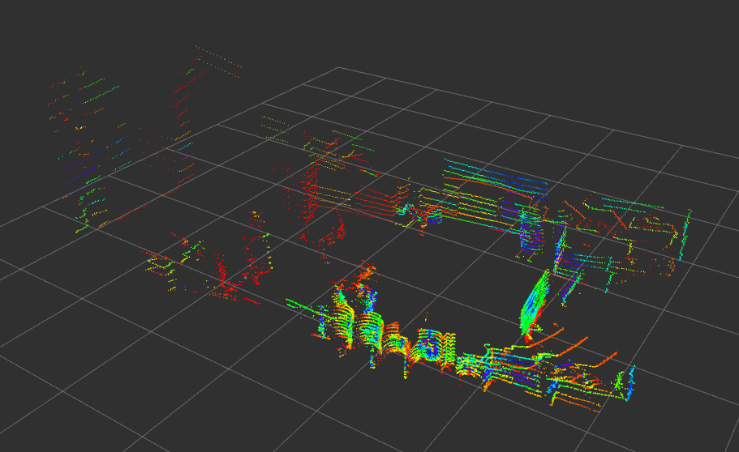
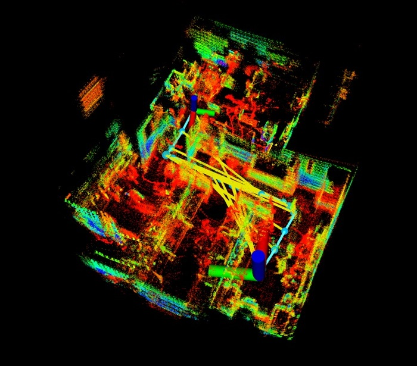

# EGG-499 quick report
## Projects detail
* Department : UNLV Electrical and Computer Engineering  
* Place : SEB #3229  
* Duration : 08/15/23 ~ 12/15/23  
* Purpose : studying based on ROS  
* Goal : mapping and navigation with rover  

<br/><br/><br/>

## Resources
### Computer
* Intel NUC Mini PC

### Rover
* Rover Robotics zero2_4WD

### Lidar
* Livox MID-360
* Velodyne VLP-16
* Quanergy M8

### Camera
* Luxonis Oak-D Lite 
* Intel RealSense D435if

<br/><br/><br/>

## Computer Setup
use [Rufus](https://rufus.ie/en/) to install [Ubuntu img file](https://releases.ubuntu.com/focal/) on USB  

fallow the instruction to install Ubuntu on PC  

after finishing Ubuntu installation, install [ROS Noetic](http://wiki.ros.org/noetic/Installation/Ubuntu) and other basic tools (git, vim, openssh-server, net-tools, terminator etc)  

<br/><br/><br/>

## Rover Setup
Depending on RoverRobotics [Setup Guide](https://roverrobotics.com/pages/computer-setup-guide), fallow the instructions  

after installation, it will automatically work after bootup  

you can controll your rover with [keyboard](http://wiki.ros.org/teleop_twist_keyboard) and joystick (need to connect controller with bluetooth)  

<br/><br/><br/>

## Lidar Setup and Test
### Livox MID-360
* basic SDK  
[Livox-SDK](https://github.com/Livox-SDK/Livox-SDK)  
[livox_ros_driver](https://github.com/Livox-SDK/livox_ros_driver)  

* mapping  
[FAST_LIO](https://github.com/hku-mars/FAST_LIO)  

<br/><br/>

### Velodyne VLP-16
* basic SDK  
[velodyne](https://github.com/ros-drivers/velodyne)  
```
roslaunch velodyne_pointcloud VLP16_points.launch
rviz -f velodyne
```

* mapping  
[LIO-SAM](https://github.com/TixiaoShan/LIO-SAM)
```
roslaunch lio_sam run.launch
``` 

<br/><br/>

### Quanergy M8
* basic SDK  
[quanergy_client](https://github.com/QuanergySystems/quanergy_client)  
[quanergy_client_ros](https://github.com/QuanergySystems/quanergy_client_ros)  

* mapping  
couldn't find

<br/><br/><br/>

## Camera Setup and Test
### Luxonis Oak-D Lite
* basic SDK  
[depthai-ros](https://github.com/luxonis/depthai-ros)  
```
roslaunch depthai_examples stereo_inertial_node.launch  
```

<br/><br/>

### Intel RealSense D435if
* basic SDK  
[realsense-ros](https://github.com/IntelRealSense/realsense-ros)  
```
roslaunch realsense2_camera rs_camera.launch filters:=pointcloud  
rviz -d pointcloud.rviz    # cd ~/camera_ws/src/realsense_ws/src/realsense-ros/realsense2_camera/rviz  
```

<br/><br/><br/>

## Results
### Drive Test
  

[Drive Test Vid](https://youtube.com/shorts/RyaQt4Vfwus)  

<br/><br/>

### Camera data
  
data with Realsense

<br/><br/>

  
data with Oak-D

<br/><br/><br/>

### Lidar data
  
data with VLP-16

<br/><br/>

  
mapping with VLP-16

<br/><br/><br/>

## Discussion
During this project, I studied ROS thoroughly and gained a comprehensive understanding of both the hardware and software components of robots. By utilizing camera data and implementing depth cloud processing, I was able to identify gaps in the environment and perceive the surroundings more accurately. Also, integrating a rover with lidar technology, I successfully obtained 3D data and created detailed maps of the environment. Although I couldn't implement a navigation function in this particular project, I successfully achieved it in a previous project, CPE-476.

<br/><br/><br/>
